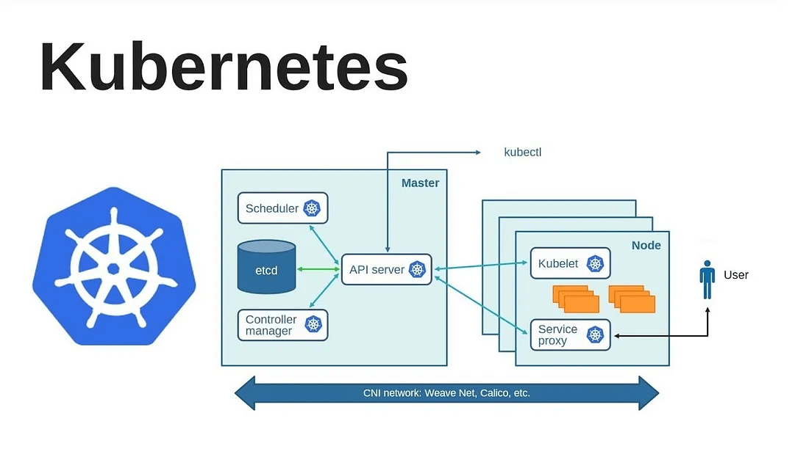
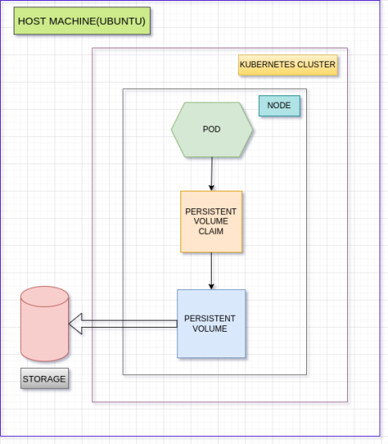

# Kubernetes Starter Guide 2025 🚀

> Complete Kubernetes learning repository with practical examples, cluster setups, and real-world projects.

[](https://kubernetes.io/)
[](https://docker.com/)
[](https://helm.sh/)

## 📋 Table of Contents
- [🏗️ Kubernetes Architecture](#️-kubernetes-architecture)
- [🔧 Cluster Setup](#-cluster-setup)
- [⚙️ Core Components](#️-core-components)
- [📦 Workloads & Controllers](#-workloads--controllers)
- [🌐 Networking & Services](#-networking--services)
- [💾 Storage & Configuration](#-storage--configuration)
- [🔐 Security & RBAC](#-security--rbac)
- [📊 Monitoring & Observability](#-monitoring--observability)
- [🚀 Advanced Topics](#-advanced-topics)
- [🎯 Projects & Examples](#-projects--examples)
- [📚 Quick Reference](#-quick-reference)
- [🛠️ Troubleshooting](#️-troubleshooting)

## 🏗️ Kubernetes Architecture

Kubernetes (K8s) is an open-source container orchestration platform that automates deployment, scaling, and management of containerized applications across clusters of hosts.

<kbd></kbd>

### 🔍 Architecture Overview
- **Control Plane**: Manages the cluster state and makes global decisions
- **Worker Nodes**: Run application workloads in containers
- **etcd**: Distributed key-value store for cluster data
- **Network**: Pod-to-pod and service communication

### 📖 Key Definitions
- **Cluster**: A set of nodes that run containerized applications
- **Node**: A worker machine in Kubernetes (VM or physical machine)
- **Pod**: Smallest deployable unit containing one or more containers
- **Container**: Lightweight, portable executable package of software

## 🔧 Cluster Setup

Multiple ways to set up Kubernetes clusters for different environments:

### 🏠 Local Development

#### [Kind](Cluster/kind-cluster/) - Kubernetes in Docker
```bash
# Install Kind
curl -Lo ./kind https://kind.sigs.k8s.io/dl/v0.20.0/kind-linux-amd64
chmod +x ./kind
sudo mv ./kind /usr/local/bin/kind

# Create cluster with config
kind create cluster --config=Cluster/kind-cluster/config.yml
```

#### [Minikube](Cluster/minikube-cluster/) - Single-node local cluster
```bash
# Install Minikube
curl -LO https://storage.googleapis.com/minikube/releases/latest/minikube-linux-amd64
sudo install minikube-linux-amd64 /usr/local/bin/minikube

# Start cluster
minikube start --driver=docker
```

#### [Metrics Server](Cluster/kind-matrics-server/) - Resource monitoring
```bash
# Apply metrics server
kubectl apply -f Cluster/kind-matrics-server/components.yml
```

### ☁️ Cloud Deployment

#### [EKS](Cluster/EKS-cluster/) - Amazon Elastic Kubernetes Service
```bash
# Create EKS cluster
eksctl create cluster --name my-cluster --region us-west-2
```

## ⚙️ Core Components

### 🎛️ Control Plane Components

#### API Server
- Central management entity and entry point for all REST commands
- Validates and configures data for API objects
- Serves as the frontend to the cluster's shared state

#### etcd
- Consistent and highly-available key-value store
- Stores all cluster data and configuration
- Backup and disaster recovery critical

#### Scheduler
- Watches for newly created Pods with no assigned node
- Selects optimal node based on resource requirements
- Considers constraints, affinity rules, and policies

#### Controller Manager
- Runs controller processes that regulate cluster state
- **Node Controller**: Monitors node health
- **Replication Controller**: Maintains correct number of pods
- **Endpoints Controller**: Populates service endpoints

#### Cloud Controller Manager
- Integrates with cloud provider APIs
- Manages cloud-specific resources (load balancers, storage)
- Separates cloud-dependent code from core Kubernetes

### 👷 Worker Node Components

#### kubelet
- Primary node agent that communicates with API server
- Manages Pod lifecycle and container health
- Reports node and Pod status to control plane

#### kube-proxy
- Network proxy maintaining network rules
- Enables service abstraction and load balancing
- Implements Kubernetes Service concept

#### Container Runtime
- Software responsible for running containers
- **containerd**: Industry-standard runtime
- **CRI-O**: Lightweight alternative
- **Docker**: Traditional but being phased out

## 📦 Workloads & Controllers

### [Namespaces](K8S/01.Namespace/) 🏷️
Logical cluster partitioning for resource isolation

```yaml
apiVersion: v1
kind: Namespace
metadata:
  name: production
  labels:
    environment: prod
    team: backend
```

**Key Commands:**
```bash
kubectl create namespace production
kubectl get namespaces
kubectl config set-context --current --namespace=production
```

### [Pods](K8S/02.Pod/) 🐳
Smallest deployable units containing one or more containers

```yaml
apiVersion: v1
kind: Pod
metadata:
  name: nginx-pod
  labels:
    app: nginx
    version: v1
spec:
  containers:
  - name: nginx
    image: nginx:1.21
    ports:
    - containerPort: 80
    resources:
      requests:
        memory: "64Mi"
        cpu: "250m"
      limits:
        memory: "128Mi"
        cpu: "500m"
```

**Pod Lifecycle States:**
- **Pending**: Pod accepted but not scheduled
- **Running**: Pod bound to node, containers running
- **Succeeded**: All containers terminated successfully
- **Failed**: At least one container failed
- **Unknown**: Pod state cannot be determined

### [Deployments](K8S/03.Deployment/) 🚀
Manage stateless applications with rolling updates

```yaml
apiVersion: apps/v1
kind: Deployment
metadata:
  name: nginx-deployment
  labels:
    app: nginx
spec:
  replicas: 3
  strategy:
    type: RollingUpdate
    rollingUpdate:
      maxUnavailable: 1
      maxSurge: 1
  selector:
    matchLabels:
      app: nginx
  template:
    metadata:
      labels:
        app: nginx
    spec:
      containers:
      - name: nginx
        image: nginx:1.21
        ports:
        - containerPort: 80
```

**Deployment Strategies:**
- **RollingUpdate**: Gradual replacement (default)
- **Recreate**: Terminate all, then create new

### [ReplicaSets](K8S/04.ReplicaSets/) 📊
Ensure specified number of pod replicas

```yaml
apiVersion: apps/v1
kind: ReplicaSet
metadata:
  name: nginx-replicaset
spec:
  replicas: 3
  selector:
    matchLabels:
      app: nginx
  template:
    metadata:
      labels:
        app: nginx
    spec:
      containers:
      - name: nginx
        image: nginx:1.21
```

### [DaemonSets](K8S/05.DaemonSet/) 🔄
Run pods on every node (logging, monitoring agents)

```yaml
apiVersion: apps/v1
kind: DaemonSet
metadata:
  name: fluentd-daemonset
spec:
  selector:
    matchLabels:
      name: fluentd
  template:
    metadata:
      labels:
        name: fluentd
    spec:
      containers:
      - name: fluentd
        image: fluentd:latest
        volumeMounts:
        - name: varlog
          mountPath: /var/log
      volumes:
      - name: varlog
        hostPath:
          path: /var/log
```

### [StatefulSets](K8S/10.Statefullset/) 🗄️
Manage stateful applications with persistent storage

```yaml
apiVersion: apps/v1
kind: StatefulSet
metadata:
  name: mysql-statefulset
spec:
  serviceName: mysql
  replicas: 3
  selector:
    matchLabels:
      app: mysql
  template:
    metadata:
      labels:
        app: mysql
    spec:
      containers:
      - name: mysql
        image: mysql:8.0
        env:
        - name: MYSQL_ROOT_PASSWORD
          value: "password"
        volumeMounts:
        - name: mysql-storage
          mountPath: /var/lib/mysql
  volumeClaimTemplates:
  - metadata:
      name: mysql-storage
    spec:
      accessModes: ["ReadWriteOnce"]
      resources:
        requests:
          storage: 10Gi
```

### [Jobs](K8S/06.Jobs/) ⚡
Run pods to completion

```yaml
apiVersion: batch/v1
kind: Job
metadata:
  name: batch-job
spec:
  completions: 3
  parallelism: 2
  template:
    spec:
      containers:
      - name: worker
        image: busybox
        command: ["sh", "-c", "echo Processing item && sleep 30"]
      restartPolicy: Never
```

### [CronJobs](K8S/07.CronJobs/) ⏰
Schedule recurring tasks

```yaml
apiVersion: batch/v1
kind: CronJob
metadata:
  name: backup-cronjob
spec:
  schedule: "0 2 * * *"  # Daily at 2 AM
  jobTemplate:
    spec:
      template:
        spec:
          containers:
          - name: backup
            image: backup-tool:latest
            command: ["sh", "-c", "backup-script.sh"]
          restartPolicy: OnFailure
```

**Cron Schedule Format:**
```
* * * * *
│ │ │ │ │
│ │ │ │ └─── Day of week (0-7, Sunday=0 or 7)
│ │ │ └───── Month (1-12)
│ │ └─────── Day of month (1-31)
│ └───────── Hour (0-23)
└─────────── Minute (0-59)
```

## 🌐 Networking & Services

### [Services](K8S/08.Service/) 🔗
Stable network endpoints for pod communication

```yaml
apiVersion: v1
kind: Service
metadata:
  name: nginx-service
  labels:
    app: nginx
spec:
  selector:
    app: nginx
  ports:
  - name: http
    port: 80
    targetPort: 80
    protocol: TCP
  type: ClusterIP
```

**Service Types:**
- **ClusterIP**: Internal cluster communication (default)
- **NodePort**: External access via node ports (30000-32767)
- **LoadBalancer**: Cloud provider load balancer
- **ExternalName**: DNS CNAME mapping

#### NodePort Service Example:
```yaml
apiVersion: v1
kind: Service
metadata:
  name: nginx-nodeport
spec:
  type: NodePort
  selector:
    app: nginx
  ports:
  - port: 80
    targetPort: 80
    nodePort: 30080
```

#### LoadBalancer Service Example:
```yaml
apiVersion: v1
kind: Service
metadata:
  name: nginx-loadbalancer
spec:
  type: LoadBalancer
  selector:
    app: nginx
  ports:
  - port: 80
    targetPort: 80
```

### [Ingress](Projects/ingress-k8s/) 🌍
HTTP/HTTPS routing and SSL termination

```yaml
apiVersion: networking.k8s.io/v1
kind: Ingress
metadata:
  name: app-ingress
  annotations:
    nginx.ingress.kubernetes.io/rewrite-target: /
    cert-manager.io/cluster-issuer: "letsencrypt-prod"
spec:
  tls:
  - hosts:
    - app.example.com
    secretName: app-tls
  rules:
  - host: app.example.com
    http:
      paths:
      - path: /
        pathType: Prefix
        backend:
          service:
            name: app-service
            port:
              number: 80
      - path: /api
        pathType: Prefix
        backend:
          service:
            name: api-service
            port:
              number: 8080
```

**Ingress Controllers:**
- **NGINX Ingress Controller**: Most popular
- **Traefik**: Modern reverse proxy
- **HAProxy**: High performance
- **Istio Gateway**: Service mesh integration

## 💾 Storage & Configuration

### [Persistent Volumes](K8S/09.PV/) 💿
Cluster-wide storage resources independent of pod lifecycle

<kbd></kbd>

```yaml
apiVersion: v1
kind: PersistentVolume
metadata:
  name: pv-storage
spec:
  capacity:
    storage: 10Gi
  accessModes:
  - ReadWriteOnce
  persistentVolumeReclaimPolicy: Retain
  storageClassName: manual
  hostPath:
    path: /data/pv-storage
```

#### Persistent Volume Claim:
```yaml
apiVersion: v1
kind: PersistentVolumeClaim
metadata:
  name: pvc-storage
spec:
  accessModes:
  - ReadWriteOnce
  resources:
    requests:
      storage: 5Gi
  storageClassName: manual
```

**Access Modes:**
- **ReadWriteOnce (RWO)**: Single node read-write
- **ReadOnlyMany (ROX)**: Multiple nodes read-only
- **ReadWriteMany (RWX)**: Multiple nodes read-write

### [ConfigMaps](K8S/11.Configmap/) ⚙️
Store non-confidential configuration data

```yaml
apiVersion: v1
kind: ConfigMap
metadata:
  name: app-config
data:
  database_url: "postgresql://localhost:5432/mydb"
  debug_mode: "true"
  max_connections: "100"
  config.yaml: |
    server:
      port: 8080
      host: 0.0.0.0
    database:
      driver: postgres
      host: db-service
```

**Using ConfigMap in Pod:**
```yaml
apiVersion: v1
kind: Pod
metadata:
  name: app-pod
spec:
  containers:
  - name: app
    image: myapp:latest
    env:
    - name: DATABASE_URL
      valueFrom:
        configMapKeyRef:
          name: app-config
          key: database_url
    volumeMounts:
    - name: config-volume
      mountPath: /etc/config
  volumes:
  - name: config-volume
    configMap:
      name: app-config
```

### [Secrets](K8S/12.Secrets/) 🔐
Store sensitive information (passwords, tokens, keys)

```yaml
apiVersion: v1
kind: Secret
metadata:
  name: app-secret
type: Opaque
data:
  username: YWRtaW4=  # base64 encoded 'admin'
  password: MWYyZDFlMmU2N2Rm  # base64 encoded password
  api-key: bXlfc2VjcmV0X2FwaV9rZXk=
```

**Secret Types:**
- **Opaque**: Arbitrary user data (default)
- **kubernetes.io/service-account-token**: Service account token
- **kubernetes.io/dockercfg**: Docker registry auth
- **kubernetes.io/tls**: TLS certificate data

#### TLS Secret Example:
```yaml
apiVersion: v1
kind: Secret
metadata:
  name: tls-secret
type: kubernetes.io/tls
data:
  tls.crt: LS0tLS1CRUdJTi... # base64 encoded cert
  tls.key: LS0tLS1CRUdJTi... # base64 encoded key
```

## 🔐 Security & RBAC

### [Role-Based Access Control](K8S/19.RBAC/) 👮
Fine-grained access control for cluster resources

#### Role Definition:
```yaml
apiVersion: rbac.authorization.k8s.io/v1
kind: Role
metadata:
  namespace: default
  name: pod-reader
rules:
- apiGroups: [""]
  resources: ["pods"]
  verbs: ["get", "watch", "list"]
- apiGroups: ["apps"]
  resources: ["deployments"]
  verbs: ["get", "list"]
```

#### ClusterRole (Cluster-wide):
```yaml
apiVersion: rbac.authorization.k8s.io/v1
kind: ClusterRole
metadata:
  name: cluster-admin-role
rules:
- apiGroups: ["*"]
  resources: ["*"]
  verbs: ["*"]
```

#### RoleBinding:
```yaml
apiVersion: rbac.authorization.k8s.io/v1
kind: RoleBinding
metadata:
  name: read-pods
  namespace: default
subjects:
- kind: User
  name: jane
  apiGroup: rbac.authorization.k8s.io
roleRef:
  kind: Role
  name: pod-reader
  apiGroup: rbac.authorization.k8s.io
```

#### Service Account:
```yaml
apiVersion: v1
kind: ServiceAccount
metadata:
  name: my-service-account
  namespace: default
```

### [Resource Quotas](K8S/13.Resource%20Quotas/) 📊
Limit resource consumption per namespace

```yaml
apiVersion: v1
kind: ResourceQuota
metadata:
  name: compute-quota
  namespace: production
spec:
  hard:
    requests.cpu: "4"
    requests.memory: 8Gi
    limits.cpu: "8"
    limits.memory: 16Gi
    persistentvolumeclaims: "10"
    pods: "20"
    services: "10"
```

### Network Policies 🛡️
Control traffic flow between pods

```yaml
apiVersion: networking.k8s.io/v1
kind: NetworkPolicy
metadata:
  name: deny-all
  namespace: production
spec:
  podSelector: {}
  policyTypes:
  - Ingress
  - Egress
```

## 📊 Monitoring & Observability

### [Kubernetes Monitoring](K8S-Monitoring/) 📈
Comprehensive monitoring setup with Prometheus and Grafana

<kbd></kbd>

#### Install Prometheus Stack:
```bash
# Add Helm repository
helm repo add prometheus-community https://prometheus-community.github.io/helm-charts
helm repo update

# Install Prometheus Stack
helm install prometheus-stack prometheus-community/kube-prometheus-stack \
  --namespace monitoring \
  --create-namespace \
  --set prometheus.service.type=NodePort \
  --set prometheus.service.nodePort=30000 \
  --set grafana.service.type=NodePort \
  --set grafana.service.nodePort=31000
```

#### Access Services:
```bash
# Port forward Prometheus
kubectl port-forward svc/prometheus-stack-kube-prom-prometheus 9090:9090 -n monitoring

# Port forward Grafana
kubectl port-forward svc/prometheus-stack-grafana 3000:80 -n monitoring

# Get Grafana password
kubectl get secret prometheus-stack-grafana -n monitoring -o jsonpath="{.data.admin-password}" | base64 --decode
```

### [Health Checks](K8S/14.Probes/) 🏥
Container health monitoring

```yaml
apiVersion: v1
kind: Pod
metadata:
  name: healthy-pod
spec:
  containers:
  - name: app
    image: myapp:latest
    ports:
    - containerPort: 8080
    livenessProbe:
      httpGet:
        path: /healthz
        port: 8080
      initialDelaySeconds: 30
      periodSeconds: 10
      timeoutSeconds: 5
      failureThreshold: 3
    readinessProbe:
      httpGet:
        path: /ready
        port: 8080
      initialDelaySeconds: 5
      periodSeconds: 5
      timeoutSeconds: 3
      successThreshold: 1
    startupProbe:
      httpGet:
        path: /startup
        port: 8080
      initialDelaySeconds: 10
      periodSeconds: 10
      timeoutSeconds: 5
      failureThreshold: 30
```

**Probe Types:**
- **Liveness Probe**: Restart unhealthy containers
- **Readiness Probe**: Control traffic routing
- **Startup Probe**: Handle slow-starting containers

**Probe Methods:**
- **HTTP GET**: HTTP endpoint check
- **TCP Socket**: TCP port check
- **Exec**: Command execution check

## 🚀 Advanced Topics

### [Horizontal Pod Autoscaler](K8S/16.HPA/) 📈
Automatic scaling based on CPU/memory metrics

```yaml
apiVersion: autoscaling/v2
kind: HorizontalPodAutoscaler
metadata:
  name: nginx-hpa
spec:
  scaleTargetRef:
    apiVersion: apps/v1
    kind: Deployment
    name: nginx-deployment
  minReplicas: 2
  maxReplicas: 10
  metrics:
  - type: Resource
    resource:
      name: cpu
      target:
        type: Utilization
        averageUtilization: 70
  - type: Resource
    resource:
      name: memory
      target:
        type: Utilization
        averageUtilization: 80
```

### [Vertical Pod Autoscaler](K8S/17.VPA/) 📊
Automatic resource request/limit adjustment

```yaml
apiVersion: autoscaling.k8s.io/v1
kind: VerticalPodAutoscaler
metadata:
  name: nginx-vpa
spec:
  targetRef:
    apiVersion: apps/v1
    kind: Deployment
    name: nginx-deployment
  updatePolicy:
    updateMode: "Auto"
  resourcePolicy:
    containerPolicies:
    - containerName: nginx
      maxAllowed:
        cpu: 1
        memory: 500Mi
      minAllowed:
        cpu: 100m
        memory: 50Mi
```

### [Taints & Tolerations](K8S/15.Taints_Tolerations/) 🏷️
Control pod scheduling on specific nodes

#### Taint a Node:
```bash
kubectl taint nodes node1 key1=value1:NoSchedule
```

#### Toleration in Pod:
```yaml
apiVersion: v1
kind: Pod
metadata:
  name: tolerant-pod
spec:
  tolerations:
  - key: "key1"
    operator: "Equal"
    value: "value1"
    effect: "NoSchedule"
  containers:
  - name: app
    image: myapp:latest
```

**Taint Effects:**
- **NoSchedule**: Don't schedule new pods
- **PreferNoSchedule**: Avoid scheduling if possible
- **NoExecute**: Evict existing pods

### [Node Affinity](K8S/18.Node_Affinity/) 🎯
Advanced pod placement rules

```yaml
apiVersion: v1
kind: Pod
metadata:
  name: affinity-pod
spec:
  affinity:
    nodeAffinity:
      requiredDuringSchedulingIgnoredDuringExecution:
        nodeSelectorTerms:
        - matchExpressions:
          - key: kubernetes.io/arch
            operator: In
            values:
            - amd64
      preferredDuringSchedulingIgnoredDuringExecution:
      - weight: 100
        preference:
          matchExpressions:
          - key: node-type
            operator: In
            values:
            - high-memory
  containers:
  - name: app
    image: myapp:latest
```

### [Custom Resource Definitions](K8S/20.Custom-Resources-Defination/) 🔧
Extend Kubernetes API with custom resources

```yaml
apiVersion: apiextensions.k8s.io/v1
kind: CustomResourceDefinition
metadata:
  name: applications.stable.example.com
spec:
  group: stable.example.com
  versions:
  - name: v1
    served: true
    storage: true
    schema:
      openAPIV3Schema:
        type: object
        properties:
          spec:
            type: object
            properties:
              replicas:
                type: integer
              image:
                type: string
  scope: Namespaced
  names:
    plural: applications
    singular: application
    kind: Application
```

### [Helm Package Manager](K8S/21.Helm/) ⚓
Kubernetes application package management

#### Install Helm:
```bash
curl https://raw.githubusercontent.com/helm/helm/main/scripts/get-helm-3 | bash
```

#### Basic Helm Commands:
```bash
# Add repository
helm repo add bitnami https://charts.bitnami.com/bitnami

# Search charts
helm search repo nginx

# Install chart
helm install my-nginx bitnami/nginx

# List releases
helm list

# Upgrade release
helm upgrade my-nginx bitnami/nginx

# Uninstall release
helm uninstall my-nginx
```

### [Init Containers](K8S/22.Init-conrainer/) 🚀
Specialized containers that run before app containers

```yaml
apiVersion: v1
kind: Pod
metadata:
  name: init-demo
spec:
  initContainers:
  - name: install-dependencies
    image: busybox:1.28
    command: ['sh', '-c', 'echo Installing dependencies && sleep 10']
  - name: setup-database
    image: postgres:13
    command: ['sh', '-c', 'echo Setting up database && sleep 5']
  containers:
  - name: app
    image: myapp:latest
    ports:
    - containerPort: 8080
```

### [Sidecar Containers](K8S/23.Sidecar-container/) 🤝
Helper containers that extend main application functionality

```yaml
apiVersion: v1
kind: Pod
metadata:
  name: sidecar-demo
spec:
  containers:
  - name: main-app
    image: myapp:latest
    ports:
    - containerPort: 8080
    volumeMounts:
    - name: shared-logs
      mountPath: /var/log
  - name: log-shipper
    image: fluentd:latest
    volumeMounts:
    - name: shared-logs
      mountPath: /var/log
  volumes:
  - name: shared-logs
    emptyDir: {}
```

### [Service Mesh with Istio](istio/) 🕸️
Advanced traffic management, security, and observability

#### Install Istio:
```bash
# Download Istio
curl -L https://istio.io/downloadIstio | sh -
cd istio-1.24.2
export PATH=$PWD/bin:$PATH

# Install Istio
istioctl install --set values.defaultRevision=default
```

## 🎯 Projects & Examples

### 🏗️ Production-Ready Applications

#### [Full-Stack Chat App](Projects/full-stack_chatApp/) 💬
Complete MERN stack with K8s deployment

**Architecture:**
- **Frontend**: React with TailwindCSS
- **Backend**: Node.js/Express with Socket.io
- **Database**: MongoDB
- **Features**: Real-time messaging, JWT authentication, file uploads

**Deployment:**
```bash
cd Projects/full-stack_chatApp/
kubectl apply -f k8s/
```

#### [MySQL StatefulSet](Projects/mysql-k8s/) 🗄️
Database deployment with persistent storage

```yaml
apiVersion: apps/v1
kind: StatefulSet
metadata:
  name: mysql
  namespace: database
spec:
  serviceName: mysql
  replicas: 1
  selector:
    matchLabels:
      app: mysql
  template:
    metadata:
      labels:
        app: mysql
    spec:
      containers:
      - name: mysql
        image: mysql:8.0
        env:
        - name: MYSQL_ROOT_PASSWORD
          valueFrom:
            secretKeyRef:
              name: mysql-secret
              key: password
        ports:
        - containerPort: 3306
        volumeMounts:
        - name: mysql-storage
          mountPath: /var/lib/mysql
  volumeClaimTemplates:
  - metadata:
      name: mysql-storage
    spec:
      accessModes: ["ReadWriteOnce"]
      resources:
        requests:
          storage: 20Gi
```

#### [Kubernetes Dashboard](Projects/kubernetes-dashboard/) 🖥️
Web-based cluster management UI

```bash
# Deploy dashboard
kubectl apply -f Projects/kubernetes-dashboard/dashbord-apply.yml

# Create service account
kubectl apply -f Projects/kubernetes-dashboard/serviceaccount.yml

# Access dashboard
kubectl proxy
```

### 📈 Scaling & Performance

#### [HPA with Apache](Projects/hpa-apache-k8s/) 
Horizontal Pod Autoscaler demonstration

#### [VPA with Apache](Projects/vpa-apache-k8s/)
Vertical Pod Autoscaler demonstration

### 🔐 Security Examples

#### [RBAC with Apache](Projects/role-apache-k8s/)
Role-based access control implementation

### ⚓ Helm Charts

#### [Apache Helm Chart](Projects/apache-helm/)
Custom Helm chart development

```yaml
# Chart.yaml
apiVersion: v2
name: apache
description: A Helm chart for Apache HTTP Server
type: application
version: 0.1.0
appVersion: "2.4.54"

# values.yaml
replicaCount: 2
image:
  repository: httpd
  tag: "2.4"
  pullPolicy: IfNotPresent
service:
  type: ClusterIP
  port: 80
```

## 📚 Quick Reference

### 🔧 Essential kubectl Commands

```bash
# Cluster Management
kubectl cluster-info                    # Display cluster info
kubectl get nodes                       # List all nodes
kubectl describe node <node-name>       # Node details

# Workload Management
kubectl get pods -A                     # List all pods
kubectl get pods -o wide                # Pods with more details
kubectl describe pod <pod-name>         # Pod details
kubectl logs <pod-name> -f              # Follow pod logs
kubectl logs <pod-name> -c <container>  # Container logs

# Resource Management
kubectl apply -f <file.yaml>            # Apply configuration
kubectl delete -f <file.yaml>           # Delete resources
kubectl get all                         # List all resources
kubectl get events --sort-by=.metadata.creationTimestamp

# Scaling
kubectl scale deployment <name> --replicas=5
kubectl autoscale deployment <name> --min=2 --max=10 --cpu-percent=80

# Debugging
kubectl exec -it <pod-name> -- /bin/bash
kubectl port-forward <pod-name> 8080:80
kubectl cp <pod-name>:/path/to/file ./local-file

# Resource Usage
kubectl top nodes                       # Node resource usage
kubectl top pods                        # Pod resource usage
kubectl top pods --containers          # Container resource usage
```

### 🏷️ Resource Management

```bash
# Labels and Selectors
kubectl get pods -l app=nginx
kubectl label pods <pod-name> environment=production
kubectl annotate pods <pod-name> description="Web server"

# Namespaces
kubectl create namespace production
kubectl get pods -n production
kubectl config set-context --current --namespace=production

# ConfigMaps and Secrets
kubectl create configmap app-config --from-file=config.properties
kubectl create secret generic app-secret --from-literal=password=secret123
kubectl get configmaps
kubectl get secrets
```

### 🔍 Troubleshooting Commands

```bash
# Pod Issues
kubectl describe pod <pod-name>
kubectl logs <pod-name> --previous
kubectl get events --field-selector involvedObject.name=<pod-name>

# Service Issues
kubectl get endpoints
kubectl describe service <service-name>

# Network Issues
kubectl exec -it <pod-name> -- nslookup <service-name>
kubectl exec -it <pod-name> -- wget -qO- <service-name>:<port>

# Resource Issues
kubectl describe nodes
kubectl top nodes
kubectl describe limitrange
kubectl describe resourcequota
```

## 🛠️ Troubleshooting

### 🚨 Common Issues and Solutions

#### Pod Stuck in Pending State
```bash
# Check node resources
kubectl describe nodes
kubectl top nodes

# Check pod events
kubectl describe pod <pod-name>

# Check resource quotas
kubectl describe resourcequota -n <namespace>
```

#### ImagePullBackOff Error
```bash
# Check image name and tag
kubectl describe pod <pod-name>

# Verify image registry access
kubectl get secrets
kubectl describe secret <registry-secret>
```

#### CrashLoopBackOff
```bash
# Check container logs
kubectl logs <pod-name> --previous

# Check liveness/readiness probes
kubectl describe pod <pod-name>

# Debug with temporary pod
kubectl run debug --image=busybox -it --rm -- sh
```

#### Service Not Accessible
```bash
# Check service endpoints
kubectl get endpoints <service-name>

# Verify pod labels match service selector
kubectl describe service <service-name>
kubectl get pods --show-labels

# Test service connectivity
kubectl exec -it <pod-name> -- wget -qO- <service-name>:<port>
```

### 🔧 Performance Optimization

#### Resource Requests and Limits
```yaml
resources:
  requests:
    memory: "64Mi"
    cpu: "250m"
  limits:
    memory: "128Mi"
    cpu: "500m"
```

#### Quality of Service Classes
- **Guaranteed**: requests = limits
- **Burstable**: requests < limits
- **BestEffort**: no requests/limits

### 📊 Key Features Summary

- **🔄 Self-Healing**: Automatic container restart and rescheduling
- **⚖️ Load Balancing**: Traffic distribution across healthy pods
- **📈 Auto-Scaling**: Dynamic resource adjustment based on demand
- **🔄 Rolling Updates**: Zero-downtime application deployments
- **🔍 Service Discovery**: Automatic service registration and discovery
- **💾 Storage Orchestration**: Automatic storage provisioning and mounting
- **🔐 Secret Management**: Secure handling of sensitive configuration
- **☁️ Multi-Cloud**: Consistent deployment across different environments

---

## 🚀 Getting Started

1. **🏠 Set up a local cluster**: Start with [Kind](Cluster/kind-cluster/) or [Minikube](Cluster/minikube-cluster/)
2. **📚 Learn core concepts**: Work through [K8S examples](K8S/) in order
3. **🎯 Deploy applications**: Try the [Projects](Projects/) for hands-on experience
4. **📊 Monitor your cluster**: Set up [monitoring](K8S-Monitoring/) with Prometheus/Grafana
5. **🚀 Explore advanced topics**: Dive into RBAC, networking, and custom resources

## 🤝 Contributing

Feel free to contribute examples, improvements, or additional projects to this repository.

## 📄 License

This project is licensed under the MIT License - see the [LICENSE](LICENSE) file for details.

---

<div align="center">

**⭐ Star this repository if it helped you learn Kubernetes! ⭐**

Made with ❤️ for the Kubernetes community

</div>